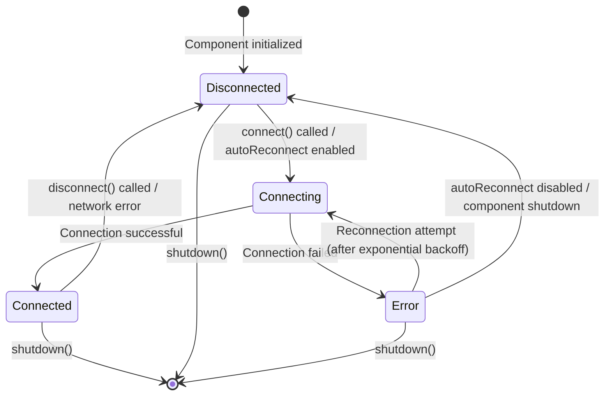

# MQTT Component State Machine

## States

The MQTT component operates in four distinct states:

```
┌──────────────┐
│ Disconnected │ ◄─── Initial state
└──────────────┘
```

1. **Disconnected** - Not connected to broker
2. **Connecting** - Connection in progress  
3. **Connected** - Successfully connected to broker
4. **Error** - Connection failed, awaiting retry

## State Transitions



**Note:** If the diagram doesn't render in your IDE preview, it will render correctly on GitHub and in most Markdown viewers that support Mermaid. You can also view it online at [mermaid.live](https://mermaid.live/).

## Detailed State Descriptions

### 1. Disconnected State

**Entry Conditions:**
- Component initialization
- User calls `disconnect()`
- Auto-reconnect disabled after error
- Component shutdown

**Behaviors:**
- No MQTT operations
- Messages can be queued (if queue not full)
- Statistics: uptime = 0

**Exit Conditions:**
- User calls `connect()`
- Auto-reconnect triggers connection attempt

**Variables:**
- `state = MQTTState::Disconnected`
- `lastError = ""`

---

### 2. Connecting State

**Entry Conditions:**
- From Disconnected: `connect()` called
- From Error: Reconnection timer expired

**Behaviors:**
- Attempt TCP connection to broker
- Send MQTT CONNECT packet
- Apply Last Will Testament (if enabled)
- Apply authentication (if configured)
- Timeout after `connectTimeout` ms (default: 10s)

**Exit Conditions:**
- **Success:** Broker sends CONNACK → Connected
- **Failure:** Timeout or rejection → Error

**Variables:**
- `state = MQTTState::Connecting`
- `lastConnectAttempt = millis()`

---

### 3. Connected State

**Entry Conditions:**
- From Connecting: Successful CONNACK received

**Behaviors:**
- **Publish** messages to broker
- **Process** incoming messages
- **Maintain** keep-alive (PINGREQ/PINGRESP)
- **Re-subscribe** to topics (if `resubscribeOnConnect = true`)
- **Process message queue** (send buffered messages)
- **Call connect callbacks**
- **Update statistics** (uptime, message counts)

**Exit Conditions:**
- User calls `disconnect()` → Disconnected
- Network error detected → Disconnected
- Broker closes connection → Disconnected

**Variables:**
- `state = MQTTState::Connected`
- `stateChangeTime = millis()` (for uptime calculation)
- `stats.connectCount++`

---

### 4. Error State

**Entry Conditions:**
- From Connecting: Connection failed

**Behaviors:**
- Record error code and message
- Increment `stats.reconnectCount`
- Start exponential backoff timer
- Queue outgoing messages (if space available)

**Exit Conditions:**
- Reconnection timer expired → Connecting (if autoReconnect)
- User disables autoReconnect → Disconnected
- Component shutdown → Terminal

**Variables:**
- `state = MQTTState::Error`
- `lastError = <error message>`
- `currentReconnectDelay` (increases exponentially)

---

## Reconnection Logic

### Exponential Backoff

```
Initial delay:  1 second  (reconnectDelay)
After failure:  2 seconds (delay × 2)
After failure:  4 seconds (delay × 2)
After failure:  8 seconds (delay × 2)
After failure: 16 seconds (delay × 2)
After failure: 30 seconds (maxReconnectDelay reached)
After failure: 30 seconds (stays at max)
...
```

**Algorithm:**
```cpp
if (now - lastConnectAttempt >= currentReconnectDelay) {
    currentReconnectDelay = min(currentReconnectDelay * 2, maxReconnectDelay);
    connect();
}
```

**Reset:**
- On successful connection, `currentReconnectDelay` resets to `reconnectDelay`

---

## Message Queue Behavior

### When Disconnected/Connecting/Error

**Publish Request:**
1. Check if queue is full (`messageQueue.size() >= maxQueueSize`)
2. If space available:
   - Add message to queue
   - Return `true` (queued)
3. If queue full:
   - Increment `stats.publishErrors`
   - Return `false` (dropped)

### When Connected

**Queue Processing:**
1. Iterate through `messageQueue`
2. Attempt to publish each message
3. Remove successfully published messages
4. Keep failed messages in queue (retry later)

---

## Error Codes

**PubSubClient Error Codes:**

| Code | Name | Description | Next State |
|------|------|-------------|------------|
| -4 | Connection Timeout | TCP connect timeout | Error |
| -3 | Connection Lost | Network dropped | Error |
| -2 | Connect Failed | TCP connection failed | Error |
| -1 | Disconnected | Clean disconnect | Disconnected |
| 0 | Success | Connected | Connected |
| 1 | Bad Protocol | Unsupported MQTT version | Error |
| 2 | Bad Client ID | Invalid client ID | Error |
| 3 | Unavailable | Broker unavailable | Error |
| 4 | Bad Credentials | Authentication failed | Error |
| 5 | Unauthorized | Not authorized | Error |

---

## Subscription Management

### On Connect

**If `resubscribeOnConnect = true`:**
```
Connected State Entry
  ↓
For each subscription in subscriptions[]:
  → mqttClient.subscribe(topic, qos)
  → Log: "Re-subscribed to {topic}"
```

### On Subscribe

**While Connected:**
```
subscribe(topic, qos) called
  ↓
Add to subscriptions[]
  ↓
mqttClient.subscribe(topic, qos)
  ↓
stats.subscriptionCount++
```

**While Disconnected:**
```
subscribe(topic, qos) called
  ↓
Add to subscriptions[]
  ↓
(Will subscribe on next connection)
```

---

## Keep-Alive Mechanism

**PubSubClient handles keep-alive automatically:**
- Send PINGREQ every `keepAlive` seconds (default: 60s)
- Expect PINGRESP within timeout
- Disconnect if no PINGRESP received

**Component's Role:**
- Set `mqttClient.setKeepAlive(config.keepAlive)`
- Call `mqttClient.loop()` regularly (< `keepAlive` interval)

---

## Lifecycle Integration

### Component Begin

```
begin() called
  ↓
Load configuration from Preferences
  ↓
Check if enabled
  ↓
  [enabled = false] → return Warning
  ↓
  [enabled = true] → Configure mqttClient
  ↓
  [autoReconnect = true] → connect()
  ↓
Return OK
```

### Component Loop

```
loop() called
  ↓
  [enabled = false] → return
  ↓
  [state = Connected] → mqttClient.loop()
                      → updateStatistics()
                      → processMessageQueue()
  ↓
  [state != Connected && autoReconnect] → handleReconnection()
```

### Component Shutdown

```
shutdown() called
  ↓
  [isConnected()] → disconnect()
  ↓
Clear subscriptions
  ↓
Clear message queue
  ↓
Return OK
```

---

## Thread Safety

**Note:** This component is **NOT thread-safe**. All methods must be called from the same task/thread.

**Recommendations:**
- Use FreeRTOS mutexes if accessing from multiple tasks
- Call all MQTT methods from Arduino `loop()` only
- Avoid blocking operations in callbacks

---

## Timing Diagram

### Successful Connection

```
Time    Component           Network              Broker
0ms     connect() ────────→ TCP SYN ──────────→
        Connecting                              
50ms                        TCP ACK ←──────────
        
55ms                        MQTT CONNECT ─────→
                            (with LWT, auth)    
100ms                                   ←────── CONNACK(Success)
        Connected                       
        onConnect() ↓
        - Publish "online"
        - Re-subscribe
        processQueue() ↓
        - Send queued msgs
```

### Failed Connection with Retry

```
Time    Component           Network              Broker
0ms     connect() ────────→ TCP SYN ──────────→
        Connecting                              
10000ms                     [TIMEOUT]
        Error
        lastError = "Timeout"
        
11000ms handleReconnection()
        (delay = 1s elapsed)
        connect() ────────→ TCP SYN ──────────→
        Connecting
        
11050ms                     TCP ACK ←──────────
11055ms                     MQTT CONNECT ─────→
11100ms                                 ←────── CONNACK(BadCreds)
        Error
        lastError = "Bad credentials"
        
13100ms handleReconnection()
        (delay = 2s elapsed)
        connect() ────────→ ...
```

---

## Best Practices

### 1. Configuration
- ✅ Set appropriate `maxQueueSize` based on RAM availability
- ✅ Use `publishRateLimit` to avoid overwhelming broker
- ✅ Enable LWT for connection status monitoring
- ✅ Use `cleanSession = false` for persistent subscriptions

### 2. Error Handling
- ✅ Monitor `getLastError()` for debugging
- ✅ Check `isConnected()` before critical operations
- ✅ Handle disconnection in `onDisconnect()` callback

### 3. Subscriptions
- ✅ Subscribe in `onConnect()` callback
- ✅ Use wildcards wisely (`+` for single level, `#` for multi-level)
- ✅ Validate topics before subscribing

### 4. Publishing
- ✅ Use QoS 0 for telemetry (acceptable loss)
- ✅ Use QoS 1 for commands (at-least-once delivery)
- ✅ Use `retain = true` for status messages
- ✅ Check return value of `publish()`

---

**Version:** 1.0  
**Date:** 2025-10-01
