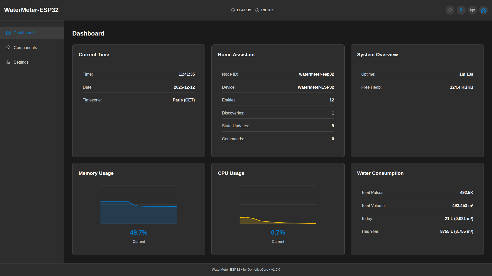
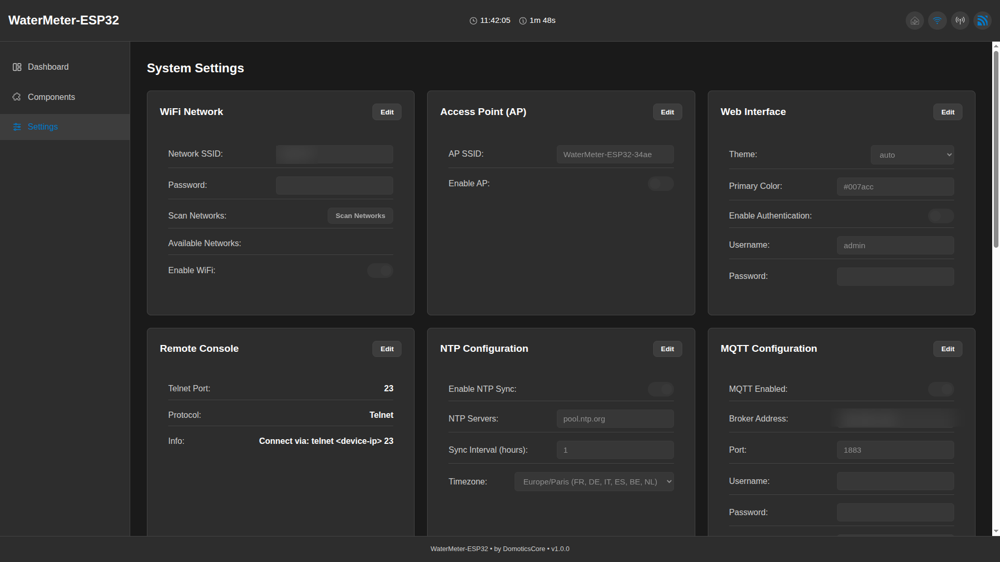
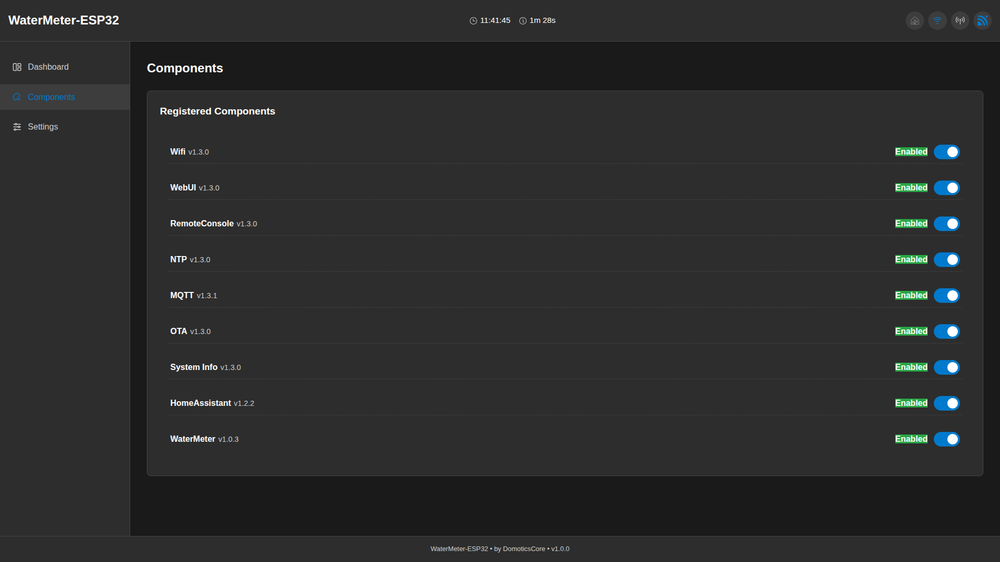
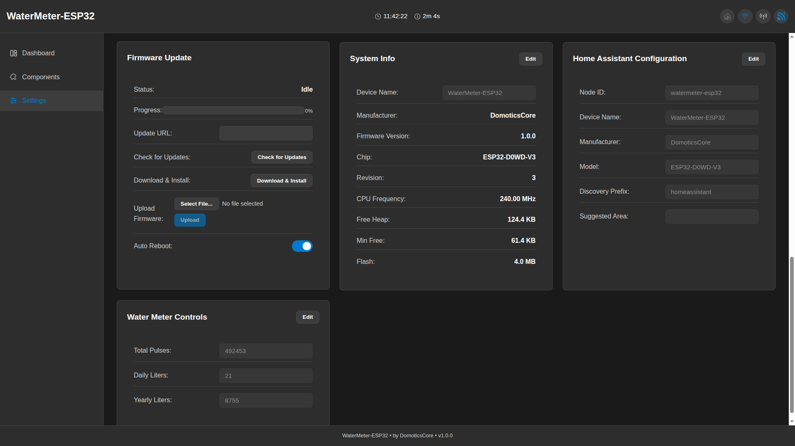
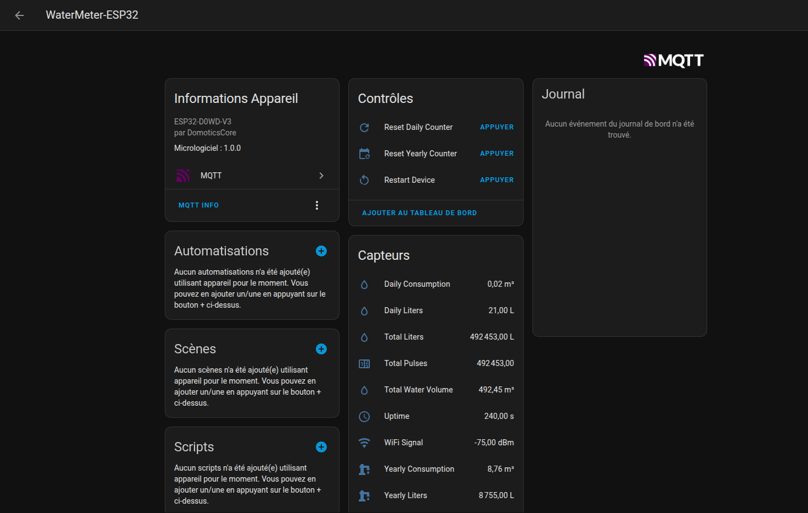

# DomoticsCore

[](https://github.com/JN0V/DomoticsCore/releases/tag/v1.5.0)
[](LICENSE)
[](https://platformio.org/)

**Production-ready ESP32 framework for IoT applications** with modular architecture, automatic error handling, and visual status indicators.

> **🎉 Version 1.5.0 Released!** EventBus cleanup fix, isolated unit tests (37 tests), mock infrastructure, spec-kit integration. See [CHANGELOG.md](CHANGELOG.md) and [Documentation Index](docs/README.md).

## ✨ What Makes DomoticsCore Different

- **🔌 Truly Modular**: Only include what you need - from a 300KB minimal core to full-featured IoT system
- **🚨 Visual Debugging**: LED status indicators work even when system fails - perfect for headless devices
- **🛡️ Production Ready**: Comprehensive error handling, component health monitoring, and graceful degradation
- **🎯 Developer Friendly**: Header-only design (no linking issues), automatic dependency resolution, extensive examples
- **📡 EventBus Architecture**: Decoupled components communicate via EventBus - no tight coupling, easy testing
- **🔧 IoT Complete**: WiFi, MQTT, Home Assistant, OTA, WebUI, Storage - everything integrated and tested

> **Note:** Components are mostly header-only (`.h` files) for zero overhead and simple integration. This is a standard C++ pattern, not ESP32-specific. See [Architecture Guide](docs/architecture.md#header-only-design) for details.

## 📷 Screenshots

WebUI and Home Assistant integration (from the [WaterMeter showcase](https://github.com/JN0V/WaterMeter)):

All screenshots are anonymized (WiFi SSID, passwords, and internal IP addresses are redacted).











## 🚀 Quick Start (3 Minutes)

### Option 1: Full System (Recommended for beginners)

Everything automatic: WiFi, LED status, remote console, error recovery!

```cpp
#include <DomoticsCore/System.h>

using namespace DomoticsCore;

System* domotics = nullptr;

void setup() {
    Serial.begin(115200);
    
    // Full-stack configuration
    SystemConfig config = SystemConfig::fullStack();
    config.deviceName = "MyDevice";
    config.wifiSSID = "YOUR_WIFI";
    config.wifiPassword = "YOUR_PASSWORD";
    config.ledPin = 2;  // Visual status on GPIO 2
    
    domotics = new System(config);
    
    // Add custom console commands
    domotics->registerCommand("hello", [](const String& args) {
        return String("Hello from DomoticsCore!\n");
    });
    
    // Initialize - automatic WiFi, LED, Console, error handling
    if (!domotics->begin()) {
        DLOG_E(LOG_APP, "System initialization failed!");
        while (1) {
            domotics->loop();  // Keep LED error animation running
            yield();
        }
    }
    
    DLOG_I(LOG_APP, "System ready!");
}

void loop() {
    domotics->loop();  // Handles everything automatically
    
    // Your application code here
}
```

**That's it!** LED patterns show system state, telnet console on port 23, error recovery built-in.

**LED States:**
- 🔵 Fast blink (200ms): Booting
- 🟡 Slow blink (1000ms): WiFi connecting  
- 🟢 Pulse (2000ms): Connected, services starting
- 🟢 Breathing (3000ms): System ready
- 🔴 **Fast blink (300ms): ERROR** (LED works even in error state!)

### Option 2: Minimal Core (Advanced users)

Use only what you need - build your own orchestration:

```cpp
#include <DomoticsCore/Core.h>
#include <DomoticsCore/LED.h>
#include <DomoticsCore/Wifi.h>

using namespace DomoticsCore;

Core core;

void setup() {
    // Add only the components you need
    core.addComponent(std::make_unique<Components::LEDComponent>());
    core.addComponent(std::make_unique<Components::WifiComponent>("SSID", "password"));
    
    // Initialize - automatic dependency resolution
    CoreConfig config;
    config.deviceName = "MinimalDevice";
    core.begin(config);
}

void loop() {
    core.loop();
}
```

Binary size: **~300KB** (vs 1MB+ for full system)

## 📦 Installation

### PlatformIO Registry (Recommended)

DomoticsCore is available on the PlatformIO Registry:

- https://registry.platformio.org/libraries/jn0v/DomoticsCore

Add to your `platformio.ini`:

```ini
[env:esp32dev]
platform = espressif32
board = esp32dev
framework = arduino

lib_deps =
    jn0v/DomoticsCore@^1.5.0
```

### PlatformIO (GitHub)

Add to your `platformio.ini`:

```ini
[env:esp32dev]
platform = espressif32
board = esp32dev
framework = arduino

lib_deps =
    https://github.com/JN0V/DomoticsCore.git#v1.5.0
```

### Specific Components Only

```ini
lib_deps = 
    symlink://path/to/DomoticsCore/DomoticsCore-Core
    symlink://path/to/DomoticsCore/DomoticsCore-LED
    symlink://path/to/DomoticsCore/DomoticsCore-Wifi
```

## 🧩 Available Components

| Component | Version | Description | Size | Status |
|-----------|---------|-------------|------|--------|
| **Core** | 1.5.0 | Framework, registry, event bus, MemoryManager, HeapTracker | ~50KB | ✅ Stable |
| **System** | 1.4.1 | High-level orchestration (batteries included) | ~100KB | ✅ Stable |
| **WiFi** | 1.4.1 | Network connectivity with AP fallback | ~40KB | ✅ Stable |
| **LED** | 1.3.0 | Visual status indicators (6 effects) | ~20KB | ✅ Stable |
| **Storage** | 1.4.1 | NVS / LittleFS persistent data | ~30KB | ✅ Stable |
| **RemoteConsole** | 1.4.1 | Telnet debugging console with WebUI integration | ~25KB | ✅ Stable |
| **WebUI** | 1.5.0 | Web interface with WebSocket + SSE dual-mode | ~150KB | ✅ Stable |
| **MQTT** | 1.4.0 | Message broker with auto-reconnect | ~40KB | ✅ Stable |
| **NTP** | 1.3.0 | Time synchronization | ~15KB | ✅ Stable |
| **OTA** | 1.4.1 | Over-the-air updates | ~30KB | ✅ Stable |
| **HomeAssistant** | 1.4.0 | Auto-discovery integration | ~20KB | ✅ Stable |
| **SystemInfo** | 1.4.0 | Real-time monitoring with charts | ~25KB | ✅ Stable |

**Total with everything:** ~545KB flash, ~50KB RAM

## 🌐 Platform Compatibility

DomoticsCore includes a **Hardware Abstraction Layer (HAL)** for platform portability.

| Platform | Status | WiFi | Storage | NTP | Full Framework |
|----------|--------|------|---------|-----|----------------|
| **ESP32** | ✅ Full Support | ✅ | ✅ NVS | ✅ SNTP | ✅ |
| **ESP32-C3** | ✅ Full Support | ✅ | ✅ NVS | ✅ SNTP | ✅ (USB CDC) |
| **ESP8266** | ⚠️ Partial | ✅ | ✅ LittleFS | ✅ configTime | ⚠️ (~80KB RAM, optimized) |
| **AVR** | ❌ Not Suitable | ❌ | ❌ | ❌ | ❌ (2KB RAM) |
| **ARM** | 🔬 Experimental | ⚠️ shields | ⚠️ | ⚠️ | ⚠️ |

> **Note:** Arduino UNO (AVR ATmega328P) has only 2KB RAM - not enough for EventBus, JSON, or WebUI. Only LEDComponent could theoretically work.

HAL headers are in `DomoticsCore-Core/include/DomoticsCore/HAL/`:
- `Platform.h` - Platform detection macros
- `WiFi.h` - Unified WiFi interface
- `Storage.h` - Key-value storage abstraction
- `NTP.h` - Time synchronization

## Versioning

DomoticsCore uses [Semantic Versioning](https://semver.org/) with **per-component versions** and a **root framework version**:

- **Root library**: The top-level `library.json` defines the `DomoticsCore` framework version (`X.Y.Z`).
- **Component libraries**: Each `DomoticsCore-*` sub-library has its own `library.json` `version` and a matching `metadata.version` in its C++ component class.
- **Propagation rules** (Model B):
  - Bumping a component **patch** -> bump the **root patch**.
  - Bumping a component **minor** -> bump the **root minor** (and reset root patch).
  - Bumping a component **major** -> bump the **root major** (and reset root minor/patch).
  - Only the changed component and the root are bumped; other components keep their current versions.

### Versioning tools

- **Consistency check** (used in CI):

  ```bash
  python tools/check_versions.py --verbose
  ```

  This script ensures that, for every `DomoticsCore-*` directory:

  - `library.json.version` matches all `metadata.version = "X.Y.Z"` assignments under `include/` and `src/`.
  - (Optionally) with `--check-tag`, the root `library.json.version` matches the Git tag `vX.Y.Z` when run on a tagged commit.

- **Version bump helper**:

  ```bash
  # Bump MQTT component and propagate the same level to the root DomoticsCore version
  python tools/bump_version.py MQTT minor

  # Equivalent explicit component name
  python tools/bump_version.py DomoticsCore-MQTT patch

  # Bump only the root DomoticsCore version
  python tools/bump_version.py root major

  # Preview changes without modifying files
  python tools/bump_version.py MQTT minor --dry-run --verbose
  ```

The bump script:

- Reads the current component `library.json.version`.
- Computes the new SemVer according to the requested level.
- Updates the component `library.json` and all `metadata.version` assignments inside that component.
- Bumps the root `library.json.version` by the same level whenever a component is bumped.

## 📖 Documentation

- **[Getting Started Guide](docs/getting-started.md)** - Comprehensive tutorial
- **[Architecture Guide](docs/architecture.md)** - Design decisions and patterns
- **[EventBus Reference](docs/reference/eventbus-architecture.md)** - Complete EventBus documentation
- **[CHANGELOG.md](CHANGELOG.md)** - Version history
- **[Complete Documentation Index](docs/README.md)** - All guides and references
- **Component READMEs** - See each `DomoticsCore-*/README.md`
- **Examples** - 19 working examples in component directories

### Key Documentation

- **LED Effects**: [DomoticsCore-LED/README.md](DomoticsCore-LED/README.md)
- **Event Bus**: [DomoticsCore-Core/README.md](DomoticsCore-Core/README.md#event-bus)
- **WebUI Development**: [docs/guides/webui-developer.md](docs/guides/webui-developer.md)
- **Custom Components**: [docs/guides/custom-components.md](docs/guides/custom-components.md)
- **Storage API**: [DomoticsCore-Storage/README.md](DomoticsCore-Storage/README.md)

## 📁 Project Structure

```
DomoticsCore/                      # Monorepo with 12 component packages
├── DomoticsCore-Core/             # Essential framework, MemoryManager, HeapTracker
├── DomoticsCore-System/           # High-level orchestration (batteries included)
├── DomoticsCore-Wifi/             # Network connectivity
├── DomoticsCore-LED/              # Visual status indicators
├── DomoticsCore-Storage/          # Persistent data (NVS / LittleFS)
├── DomoticsCore-RemoteConsole/    # Telnet debugging console
├── DomoticsCore-WebUI/            # Web interface with WebSocket + SSE
├── DomoticsCore-MQTT/             # Message broker client
├── DomoticsCore-NTP/              # Time synchronization
├── DomoticsCore-OTA/              # Firmware updates
├── DomoticsCore-HomeAssistant/    # Auto-discovery integration
├── DomoticsCore-SystemInfo/       # System monitoring
├── docs/                          # Guides, architecture, reference docs
├── tests/                         # Unit tests and mocks
├── examples/                      # Examples index
├── specs/                         # Feature specifications
└── tools/                         # Version management scripts

Each component has:
├── include/                       # Public headers
├── src/                           # Implementation (if needed)
├── examples/                      # Working examples
├── README.md                      # Component documentation
└── library.json                   # Package metadata
```

## 💡 Examples

### Full-Featured Application

**Location:** [`DomoticsCore-System/examples/FullStack/`](DomoticsCore-System/examples/FullStack/)

Complete IoT device with:
- ✅ WiFi with AP fallback
- ✅ LED status indicators
- ✅ Telnet console (port 23)
- ✅ Web interface (port 80)
- ✅ MQTT with Home Assistant discovery
- ✅ OTA updates
- ✅ NTP time sync
- ✅ Persistent storage
- ✅ Custom sensor integration

**Binary:** ~900KB flash, ~50KB RAM

### Minimal Core

**Location:** `DomoticsCore-Core/examples/01-CoreOnly/`

Bare minimum:
- ✅ Component registry
- ✅ Logging system
- ✅ Non-blocking timers

**Binary:** ~250KB flash, ~15KB RAM

### LED Status Patterns

**Location:** `DomoticsCore-LED/examples/BasicLED/`

Demonstrates all LED effects:
- Solid on/off
- Blink (configurable speed)
- Fade in/out
- Pulse/heartbeat
- Breathing
- Rainbow cycle

### Component Development

**Location:** `DomoticsCore-Core/examples/02-CoreWithDummyComponent/`

Learn to build custom components:
- Component lifecycle (begin/loop/shutdown)
- Dependency declaration
- Configuration management
- Health monitoring

### Event Bus Communication

**Location:** [`DomoticsCore-Core/examples/03-EventBusBasics/`](DomoticsCore-Core/examples/03-EventBusBasics/)

Inter-component messaging:
- Publish/subscribe pattern
- Sticky events
- Type-safe payloads
- Event coordination

### All Examples

See [`examples/README.md`](examples/README.md) for the complete list of 30+ examples across all components.

## 🔧 Key Features Deep Dive

### Error Recovery

System continues running even when components fail:

```cpp
if (!domotics->begin()) {
    DLOG_E(LOG_APP, "Init failed!");
    while (1) {
        domotics->loop();  // LED shows ERROR, console still accessible
        yield();
    }
}
```

LED fast-blinks (300ms) to indicate error state. Telnet console remains available for debugging.

### Automatic Dependency Resolution

Components declare dependencies, framework initializes in correct order:

```cpp
class MyComponent : public IComponent {
    std::vector<String> getDependencies() const override {
        return {"Storage", "Wifi"};  // Will init after these
    }
};
```

### Visual Status Indicators

LED shows system state without serial console:

- **BOOTING** → Fast blink (200ms)
- **WIFI_CONNECTING** → Slow blink (1000ms)
- **WIFI_CONNECTED** → Pulse (2000ms)
- **READY** → Breathing (3000ms)
- **ERROR** → Fast blink (300ms)
- **OTA_UPDATE** → Solid on

### Event Bus

Decouple components with topic-based messaging:

```cpp
// Publisher
struct TempData { float celsius; };
eventBus().publish("sensor.temperature", TempData{22.5});

// Subscriber
eventBus().subscribe("sensor.temperature", [](const void* data) {
    auto* temp = static_cast<const TempData*>(data);
    Serial.printf("Temp: %.1f°C\n", temp->celsius);
}, this);
```

### Chunked HTTP Responses

WebUI handles large responses (>40KB) automatically:

```cpp
// Automatically uses chunked transfer encoding for large schemas
webUI->serveSchema();  // Works even with 50KB+ JSON
```

## 🤝 Contributing

Contributions welcome! Please:

1. Fork the repository
2. Create a feature branch (`git checkout -b feature/amazing-feature`)
3. Follow existing code style
4. Add tests if applicable
5. Update documentation
6. Submit a pull request

See [Architecture Guide](docs/architecture.md) for design patterns.

## 📄 License

MIT License - see [LICENSE](LICENSE) file for details.

## 🙏 Acknowledgments

Built on top of excellent ESP32 ecosystem:
- **Arduino Core for ESP32**
- **ESPAsyncWebServer** (3.x)
- **AsyncTCP** (3.x)
- **PubSubClient** (MQTT)
- **ArduinoJson** (7.x)

## 📞 Support

- **Issues**: [GitHub Issues](https://github.com/JN0V/DomoticsCore/issues)
- **Discussions**: [GitHub Discussions](https://github.com/JN0V/DomoticsCore/discussions)
- **Documentation**: See `docs/` folder and component READMEs

## 🗺️ Roadmap

### Completed
- ✅ PlatformIO Registry publication
- ✅ ESP32-C3 full support (USB CDC serial)
- ✅ MemoryManager for device-agnostic memory adaptation
- ✅ HeapTracker for memory leak testing (native + hardware)
- ✅ ESP8266 memory optimizations (4 spec phases completed)
- ✅ WebUI SSE dual-mode transport
- ✅ RemoteConsole WebUI integration
- ✅ 37+ isolated unit tests with mock infrastructure

### Current Priorities
- ESP8266 full framework validation
- Additional Home Assistant entity types
- Performance profiling and optimization

---

**Made with ❤️ for the ESP32 community**
