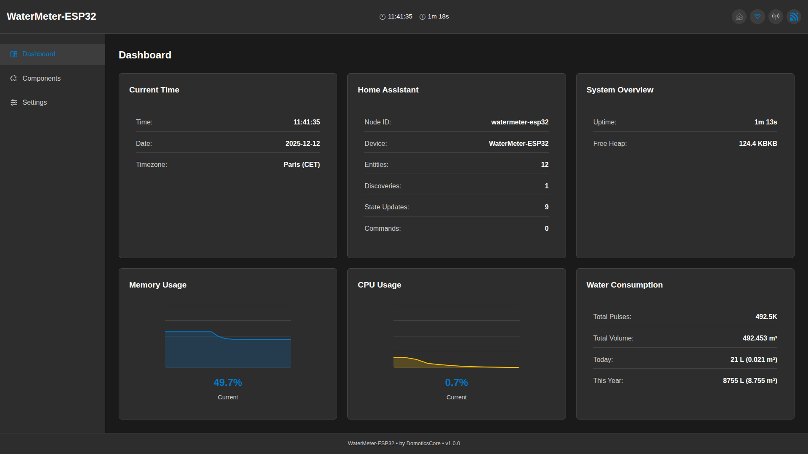
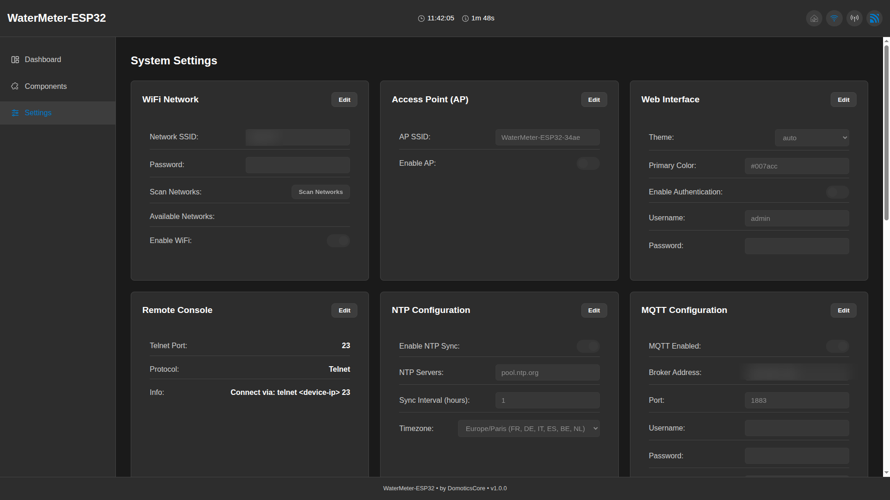
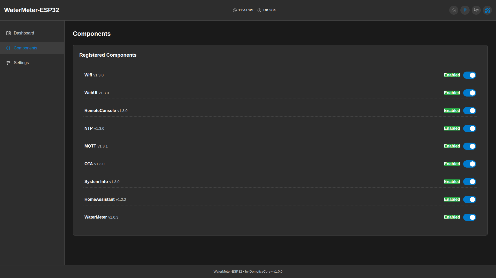
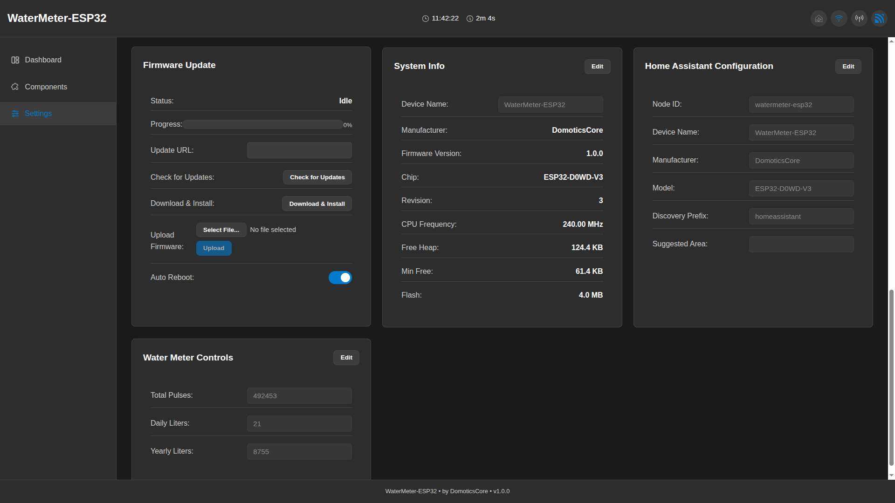
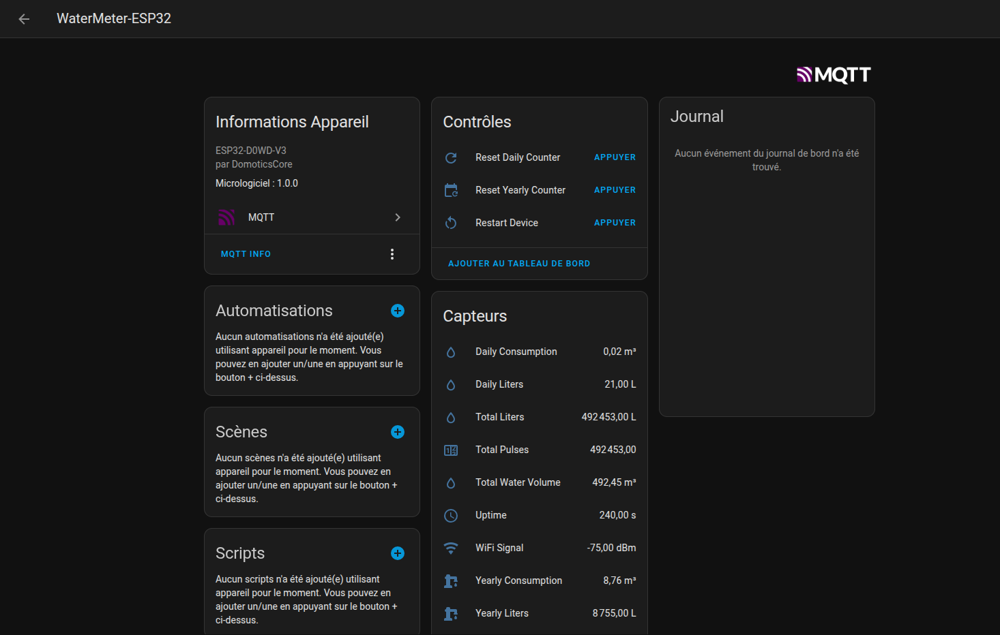

<!-- workline
sources: [library.json, library.properties, DomoticsCore-Core/library.json, DomoticsCore-HomeAssistant/library.json, DomoticsCore-LED/library.json, DomoticsCore-MQTT/library.json, DomoticsCore-NTP/library.json, DomoticsCore-OTA/library.json, DomoticsCore-RemoteConsole/library.json, DomoticsCore-Storage/library.json, DomoticsCore-System/library.json, DomoticsCore-SystemInfo/library.json, DomoticsCore-WebUI/library.json, DomoticsCore-Wifi/library.json, DomoticsCore-System/include/DomoticsCore/System.h, DomoticsCore-System/include/DomoticsCore/SystemConfig.h, DomoticsCore-Core/include/DomoticsCore/Core.h, DomoticsCore-Core/include/DomoticsCore/IComponent.h, tools/check_versions.py, tools/bump_version.py]
checked: d54dae8
judged-in-parts: 25bc3f1
-->

# DomoticsCore

[](https://github.com/JN0V/DomoticsCore/releases/tag/v2.0.0)
[](LICENSE)
[](https://platformio.org/)

**Production-ready ESP32 framework for IoT applications** with modular architecture, automatic error handling, and visual status indicators.

> **🎉 Version 2.0.0 Released!** Breaking change: HomeAssistant callbacks removed in favor of EventBus `ha/command` events. Virtual dispatch for all HA entities, complete code remediation roadmap done. See [CHANGELOG.md](CHANGELOG.md) and [Documentation Index](docs/README.md).

## ✨ What Makes DomoticsCore Different

- **🔌 Truly Modular**: Only include what you need - from a 300KB minimal core to full-featured IoT system
- **🚨 Visual Debugging**: LED status indicators work even when system fails - perfect for headless devices
- **🛡️ Production Ready**: Comprehensive error handling, component health monitoring, and graceful degradation
- **🎯 Developer Friendly**: Header-only design (no linking issues), automatic dependency resolution, extensive examples
- **📡 EventBus Architecture**: Decoupled components communicate via EventBus - no tight coupling, easy testing
- **🔧 IoT Complete**: WiFi, MQTT, Home Assistant, OTA, WebUI, Storage - everything integrated and tested

> **Note:** Components are mostly header-only (`.h` files) for zero overhead and simple integration. This is a standard C++ pattern, not ESP32-specific. See [Architecture Guide](docs/architecture.md#header-only-design) for details.

## 📷 Screenshots

WebUI and Home Assistant integration (from the [WaterMeter showcase](https://github.com/JN0V/WaterMeter)):

All screenshots are anonymized (WiFi SSID, passwords, and internal IP addresses are redacted).











## 🚀 Quick Start (3 Minutes)

Two complete sketches — the full system with its LED states, and a minimal core — are in [Quick Start and Key Features](docs/project/quick-start-and-features.md).

## 📦 Installation

### PlatformIO Registry (Recommended)

DomoticsCore is available on the PlatformIO Registry:

- https://registry.platformio.org/libraries/jn0v/DomoticsCore

Add to your `platformio.ini`:

```ini
[env:esp32dev]
platform = espressif32
board = esp32dev
framework = arduino

lib_deps =
    jn0v/DomoticsCore@^2.5.0
```

### PlatformIO (GitHub)

Add to your `platformio.ini`:

```ini
[env:esp32dev]
platform = espressif32
board = esp32dev
framework = arduino

lib_deps =
    https://github.com/JN0V/DomoticsCore.git#v2.5.0
```

### Specific Components Only

```ini
lib_deps = 
    symlink://path/to/DomoticsCore/DomoticsCore-Core
    symlink://path/to/DomoticsCore/DomoticsCore-LED
    symlink://path/to/DomoticsCore/DomoticsCore-Wifi
```

### A Local Checkout

```ini
lib_deps =
    symlink://../DomoticsCore
```

`symlink://` (PlatformIO 6.1.19 or later) compiles the library where it
lives, so an edit in the checkout is seen by the next build. `file://` copies
the whole repository into `.pio/libdeps` and never refreshes the copy. When a
project switches between a registry version and a checkout, delete its `.pio`
once: PlatformIO keeps the package it already holds.

### Upgrading

Every release entry in [CHANGELOG.md](CHANGELOG.md) opens with what a sketch
sees — removed symbols, changed defaults, new behaviour — before the list of
fixes. Read the entries between the version you run and the one you take.

## Versioning

DomoticsCore uses [Semantic Versioning](https://semver.org/) with **per-component versions** and a **root framework version**:

The propagation rules and the `tools/check_versions.py` and `tools/bump_version.py` scripts are described in [Versioning and Roadmap](docs/project/versioning-and-roadmap.md).

## 📖 Documentation

- **[Getting Started Guide](docs/getting-started.md)** - Comprehensive tutorial
- **[Architecture Guide](docs/architecture.md)** - Design decisions and patterns
- **[EventBus Reference](docs/reference/eventbus-architecture.md)** - Complete EventBus documentation
- **[CHANGELOG.md](CHANGELOG.md)** - Version history
- **[Complete Documentation Index](docs/README.md)** - All guides and references
- **Component READMEs** - See each `DomoticsCore-*/README.md`
- **Examples** - 19 working examples in component directories
- **[Quick Start and Key Features](docs/project/quick-start-and-features.md)** - Full and minimal sketches, error recovery, dependency resolution, LED states, Event Bus, chunked responses
- **[Components and Project Layout](docs/project/components.md)** - Component versions and sizes, platform compatibility, project structure, more examples, acknowledgments
- **[Versioning and Roadmap](docs/project/versioning-and-roadmap.md)** - Version propagation rules, versioning tools, roadmap

### Key Documentation

- **LED Effects**: [DomoticsCore-LED/README.md](DomoticsCore-LED/README.md)
- **Event Bus**: [DomoticsCore-Core/README.md](DomoticsCore-Core/README.md#event-bus)
- **WebUI Development**: [docs/guides/webui-developer.md](docs/guides/webui-developer.md)
- **Custom Components**: [docs/guides/custom-components.md](docs/guides/custom-components.md)
- **Storage API**: [DomoticsCore-Storage/README.md](DomoticsCore-Storage/README.md)
- **Observing a device in production** (crashes, reboots, memory): [docs/reliability/observing-a-device.md](docs/reliability/observing-a-device.md)

## 💡 Examples

### Full-Featured Application

**Location:** [`DomoticsCore-System/examples/FullStack/`](DomoticsCore-System/examples/FullStack/)

Complete IoT device with:
- ✅ WiFi with AP fallback
- ✅ LED status indicators
- ✅ Telnet console (port 23)
- ✅ Web interface (port 80)
- ✅ MQTT with Home Assistant discovery
- ✅ OTA updates
- ✅ NTP time sync
- ✅ Persistent storage
- ✅ Custom sensor integration

**Binary:** ~900KB flash, ~50KB RAM

More examples — minimal core, LED status patterns, component development — are described in [Components and Project Layout](docs/project/components.md).

### Event Bus Communication

**Location:** [`DomoticsCore-Core/examples/03-EventBusBasics/`](DomoticsCore-Core/examples/03-EventBusBasics/)

Inter-component messaging:
- Publish/subscribe pattern
- Sticky events
- Type-safe payloads
- Event coordination

### All Examples

See [`examples/README.md`](examples/README.md) for the complete list of 19 working examples across all components.

## 🤝 Contributing

Contributions welcome! Please:

1. Fork the repository
2. Create a feature branch (`git checkout -b feature/amazing-feature`)
3. Follow existing code style
4. Add tests if applicable
5. Update documentation
6. Submit a pull request

See [Architecture Guide](docs/architecture.md) for design patterns.

## 📄 License

MIT License - see [LICENSE](LICENSE) file for details.

## 📞 Support

- **Issues**: [GitHub Issues](https://github.com/JN0V/DomoticsCore/issues)
- **Discussions**: [GitHub Discussions](https://github.com/JN0V/DomoticsCore/discussions)
- **Documentation**: See `docs/` folder and component READMEs

---

**Made with ❤️ for the ESP32 community**
