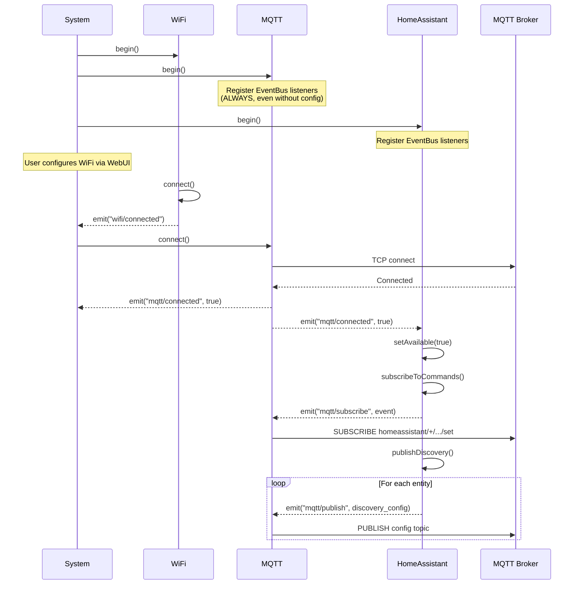
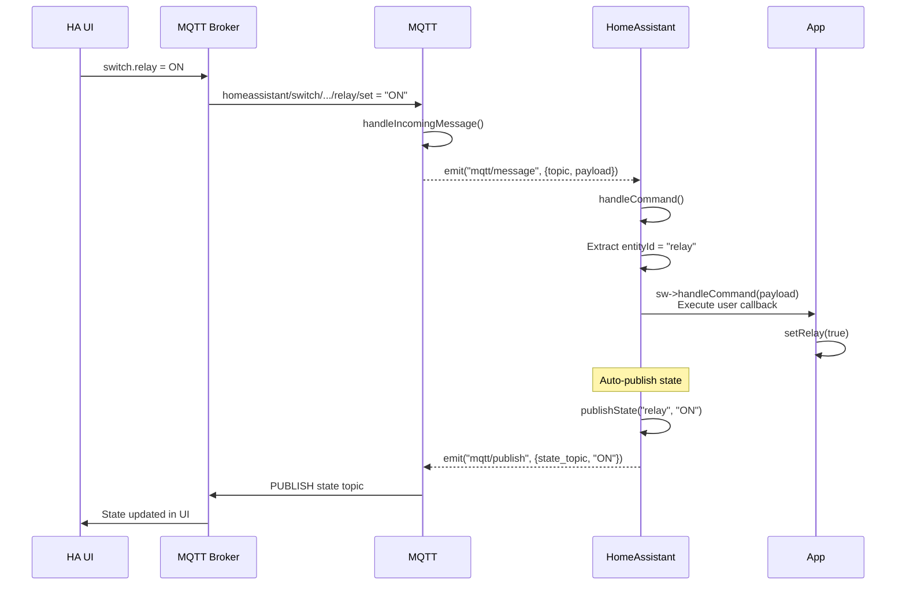

# EventBus Architecture - DomoticsCore

**Version**: 1.0  
**Date**: 2025-11-14  
**Status**: ✅ Production

---

## 📋 Table of Contents

1. [Overview](#overview)
2. [EventBus Decoupling](#eventbus-decoupling)
3. [Event Flow Diagram](#event-flow-diagram)
4. [Component Events](#component-events)
5. [Implementation Details](#implementation-details)
6. [Best Practices](#best-practices)
7. [Troubleshooting](#troubleshooting)

---

## Overview

DomoticsCore uses an **EventBus architecture** for inter-component communication. Components communicate by emitting and listening to typed events, eliminating direct dependencies and improving modularity.

### Key Benefits

- ✅ **Loose Coupling**: Components don't need direct references to each other
- ✅ **Testability**: Components can be tested in isolation
- ✅ **Flexibility**: New components can tap into existing events without modifying core
- ✅ **Maintainability**: Clear separation of concerns

### Architecture Principle

**Components should register EventBus listeners BEFORE checking runtime configuration.**

This ensures that listeners are always available, even if a component starts without configuration (e.g., MQTT without broker settings).

---

## EventBus Decoupling

### Before (Direct Callbacks)

```cpp
// ❌ Tight coupling - components directly reference each other
class HomeAssistant {
    void begin() {
        mqtt->onConnect([this]() { publishDiscovery(); });
        mqtt->onMessage([this](String topic, String payload) {
            handleCommand(topic, payload);
        });
    }
};
```

**Problems:**
- HomeAssistant depends on MQTT interface
- Can't test HomeAssistant without MQTT
- Hard to add new components that react to MQTT events

### After (EventBus)

```cpp
// ✅ Loose coupling - components communicate via events
class HomeAssistant {
    void begin() {
        // Listen to events
        on<bool>("mqtt/connected", [this](const bool&) {
            publishDiscovery();
        });
        
        on<MQTTMessageEvent>("mqtt/message", [this](const MQTTMessageEvent& ev) {
            handleCommand(String(ev.topic), String(ev.payload));
        });
    }
};
```

**Benefits:**
- HomeAssistant only depends on event types
- Can test with mock events
- Other components can also listen to `mqtt/connected`

---

## Event Flow Diagram

### System Boot Sequence



### Command Handling Flow



---

## Component Events

### MQTT Component

#### Emitted Events

| Event Name | Type | Payload | When |
|------------|------|---------|------|
| `mqtt/connected` | `bool` | `true` | After successful connection to broker |
| `mqtt/disconnected` | `bool` | `true` | After disconnection from broker |
| `mqtt/message` | `MQTTMessageEvent` | `{topic, payload}` | When message received from broker |

#### Listened Events

| Event Name | Type | Handler |
|------------|------|---------|
| `mqtt/publish` | `MQTTPublishEvent` | Publishes message to broker |
| `mqtt/subscribe` | `MQTTSubscribeEvent` | Subscribes to topic (with wildcards) |

#### Event Structures

```cpp
struct MQTTPublishEvent {
    char topic[160];      // MQTT topic
    char payload[2048];   // Message payload
    uint8_t qos;          // QoS level (0, 1, 2)
    bool retain;          // Retain flag
};

struct MQTTSubscribeEvent {
    char topic[160];      // Topic filter (supports +, # wildcards)
    uint8_t qos;          // QoS level
};

struct MQTTMessageEvent {
    char topic[160];      // Message topic
    char payload[2048];   // Message payload
};
```

### HomeAssistant Component

#### Emitted Events

| Event Name | Type | Payload | When |
|------------|------|---------|------|
| `mqtt/publish` | `MQTTPublishEvent` | Discovery/state data | Publishing to MQTT |
| `mqtt/subscribe` | `MQTTSubscribeEvent` | Command topics | Subscribing to commands |

#### Listened Events

| Event Name | Type | Handler |
|------------|------|---------|
| `mqtt/connected` | `bool` | Publishes availability and discovery |
| `mqtt/disconnected` | `bool` | Logs disconnection |
| `mqtt/message` | `MQTTMessageEvent` | Routes commands to entities |

### WiFi Component

#### Emitted Events

| Event Name | Type | Payload | When |
|------------|------|---------|------|
| `wifi/connected` | `bool` | `true` | After successful connection |
| `wifi/disconnected` | `bool` | `true` | After disconnection |

### System Orchestration

The `System.h` component orchestrates events between components:

```cpp
// WiFi → MQTT orchestration
on<bool>("wifi/connected", [this](const bool&) {
    if (mqtt && mqtt->isEnabled()) {
        mqtt->connect();
    }
});

// MQTT → HomeAssistant orchestration
on<bool>("mqtt/connected", [this](const bool&) {
    if (homeAssistant) {
        homeAssistant->publishDiscovery();
    }
});
```

---

## Implementation Details

### Component Lifecycle and EventBus Registration

#### ✅ Correct Pattern

```cpp
ComponentStatus MQTTComponent::begin() {
    DLOG_I(LOG_MQTT, "Initializing");
    
    // ✅ STEP 1: Register EventBus listeners FIRST
    // This ensures listeners are ready even without runtime config
    on<MQTTPublishEvent>("mqtt/publish", [this](const MQTTPublishEvent& ev) {
        publish(String(ev.topic), String(ev.payload), ev.qos, ev.retain);
    });
    
    on<MQTTSubscribeEvent>("mqtt/subscribe", [this](const MQTTSubscribeEvent& ev) {
        subscribe(String(ev.topic), ev.qos);
    });
    
    DLOG_I(LOG_MQTT, "EventBus listeners registered");
    
    // ✅ STEP 2: Load runtime configuration
    loadConfiguration();
    
    // ✅ STEP 3: Check if component should be active
    if (config.broker.isEmpty()) {
        config.enabled = false;
        DLOG_W(LOG_MQTT, "No broker configured - component disabled");
        return ComponentStatus::Success;  // Inactive but listeners ready
    }
    
    // ✅ STEP 4: Initialize active resources
    mqttClient.setServer(config.broker.c_str(), config.port);
    // ...
    
    return ComponentStatus::Success;
}
```

#### ❌ Anti-Pattern (Bug)

```cpp
ComponentStatus MQTTComponent::begin() {
    loadConfiguration();
    
    if (config.broker.isEmpty()) {
        return ComponentStatus::Success;  // ❌ Early return!
    }
    
    // ❌ These listeners are NEVER registered without config
    on<MQTTPublishEvent>("mqtt/publish", ...);
    on<MQTTSubscribeEvent>("mqtt/subscribe", ...);
}
```

**Why this is a bug:**
1. Component starts without config
2. EventBus listeners never registered
3. User configures component via WebUI
4. Other components emit events
5. **No listener exists → events lost**
6. User must reboot for listeners to be registered

### PubSubClient Callback Bridge

The MQTT component uses `mqttClient.setCallback(mqttCallback)` to bridge between PubSubClient (C library) and C++ EventBus:

```cpp
// Static C-style callback required by PubSubClient
inline void MQTTComponent::mqttCallback(char* topic, byte* payload, unsigned int length) {
    if (instance) {
        instance->handleIncomingMessage(topic, payload, length);
    }
}

// C++ method that emits EventBus event
void MQTTComponent::handleIncomingMessage(char* topic, byte* payload, unsigned int length) {
    // Convert to String
    String topicStr = String(topic);
    String payloadStr = String((char*)payload).substring(0, length);
    
    // Emit EventBus event
    MQTTMessageEvent ev{};
    strncpy(ev.topic, topicStr.c_str(), sizeof(ev.topic) - 1);
    ev.topic[sizeof(ev.topic) - 1] = '\0';
    strncpy(ev.payload, payloadStr.c_str(), sizeof(ev.payload) - 1);
    ev.payload[sizeof(ev.payload) - 1] = '\0';
    emit("mqtt/message", ev);
}
```

**This callback is necessary** and is NOT the same as the application-level callbacks that were removed during EventBus migration.

---

## Best Practices

### 1. Always Register Listeners First

```cpp
// ✅ Good
begin() {
    registerEventBusListeners();
    loadConfiguration();
    if (!hasConfig()) return;
    initializeResources();
}

// ❌ Bad
begin() {
    loadConfiguration();
    if (!hasConfig()) return;  // Listeners never registered!
    registerEventBusListeners();
}
```

### 2. Use Typed Events

```cpp
// ✅ Good - Type safety
struct MyEvent {
    char data[128];
    int value;
};
on<MyEvent>("my/event", [](const MyEvent& ev) { ... });
emit("my/event", MyEvent{...});

// ❌ Bad - No type safety
on<void*>("my/event", [](void* data) { ... });
```

### 3. Emit Events, Don't Call Directly

```cpp
// ✅ Good - Loose coupling
emit("mqtt/publish", MQTTPublishEvent{...});

// ❌ Bad - Tight coupling
mqtt->publish(topic, payload);
```

### 4. Handle Event Absence Gracefully

```cpp
// ✅ Good - Defensive
if (!mqtt || !mqtt->isConnected()) {
    DLOG_W(LOG, "MQTT not available, skipping publish");
    return;
}
emit("mqtt/publish", event);

// ❌ Bad - Assumes MQTT exists
emit("mqtt/publish", event);  // Silently fails if no listener
```

---

## Troubleshooting

### Problem: Events Not Received

**Symptom**: Component emits event but no handler is called

**Possible Causes:**
1. ✅ **Listener registered after early return** (most common)
   - Solution: Move listener registration before config checks
   
2. ✅ **Wrong event type**
   - Check that emit type matches listener type exactly
   
3. ✅ **Wrong event name**
   - Event names are case-sensitive strings

**Debug:**
```cpp
// Add logging to verify registration
on<MyEvent>("my/event", [](const MyEvent& ev) {
    DLOG_I(LOG, "Event received!");
});
DLOG_I(LOG, "Listener registered for: my/event");
```

### Problem: Component State Not Updated

**Symptom**: Command received but state not published back

**Possible Causes:**
1. ✅ **Auto-publish disabled** (`optimistic = true` for switches)
2. ✅ **MQTT not connected** when `publishState()` called
3. ✅ **EventBus event not emitted**

**Debug:**
```cpp
void publishState(const String& id, const String& state) {
    DLOG_I(LOG_HA, "Publishing state: %s = %s", id.c_str(), state.c_str());
    mqttPublish(topic, state, 0, entity->retained);
}
```

### Problem: Need to Reboot for Config Changes

**Symptom**: Component configured via WebUI but doesn't work until reboot

**Root Cause**: EventBus listeners registered after config check

**Solution**: Move listener registration to beginning of `begin()` method

---

## Migration from Direct Callbacks

### Old Code (Direct Callbacks)

```cpp
mqtt->onConnect([this]() {
    publishDiscovery();
});

mqtt->onMessage([this](String topic, String payload) {
    handleCommand(topic, payload);
});

mqtt->publish(topic, payload);
mqtt->subscribe(topic);
```

### New Code (EventBus)

```cpp
on<bool>("mqtt/connected", [this](const bool&) {
    publishDiscovery();
});

on<MQTTMessageEvent>("mqtt/message", [this](const MQTTMessageEvent& ev) {
    handleCommand(String(ev.topic), String(ev.payload));
});

emit("mqtt/publish", MQTTPublishEvent{topic, payload, qos, retain});
emit("mqtt/subscribe", MQTTSubscribeEvent{topic, qos});
```

### Key Changes

1. **No direct component references**
   - Before: `mqtt->onConnect(...)`
   - After: `on<bool>("mqtt/connected", ...)`

2. **Structured event data**
   - Before: Function parameters
   - After: Event structs with fixed-size buffers

3. **Fire-and-forget emission**
   - Before: Direct method call with return value
   - After: `emit()` returns void, listeners handle asynchronously

---

## Summary

The EventBus architecture provides a robust, maintainable foundation for DomoticsCore's component system. Key takeaways:

- ✅ Register EventBus listeners BEFORE configuration checks
- ✅ Use typed events for type safety
- ✅ Emit events instead of calling methods directly
- ✅ Handle missing components gracefully
- ✅ PubSubClient callback bridge is necessary and correct

This architecture enables components to be developed, tested, and deployed independently while maintaining a clear communication contract through well-defined events.
